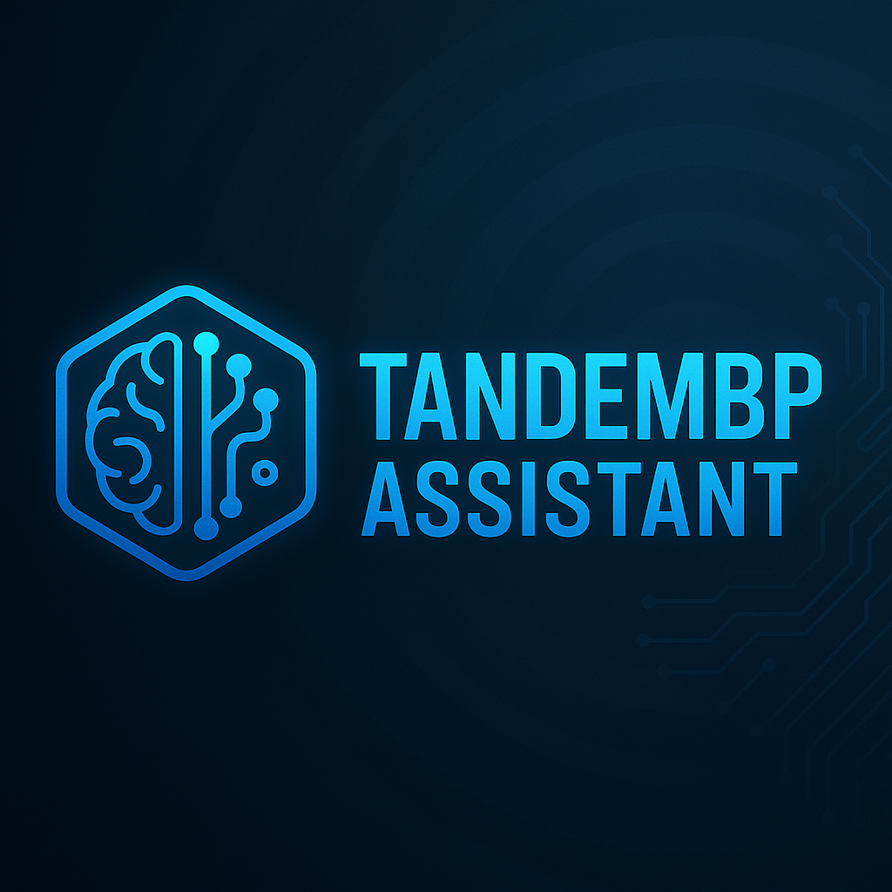

<p align="center">
  
</p>

# TandemBP Assistant

**TandemBP Assistant** is a powerful all-in-one AI-driven Blueprint development plugin for **Unreal Engine 5.5.4+** and **UE 5.6+**.

🚀 Designed to automate, organize, and accelerate your game development process — especially for Blueprint-focused teams and solo developers.

---

## 🎯 Features

- 🧠 **Game Type Recognition**: Detects your project style and suggests systems
- âš¡ **One-Click Game Bootstrap**: Automatically creates:
  - GameMode, GameInstance
  - Player Controller, HUD, and Input Actions
  - Blueprint systems based on selected game type
- 📁 **Auto Folder Organization**: Neatly places assets into structured subfolders
- 🧱 **System Blueprint Logic**: Injects default logic and comments into event graphs
- 📑 **Design Doc Generator**: Outputs a design summary `.txt` file in `/Saved/TandemDesignDocs`
- 📋 **System Registry**: Tracks every Blueprint created and displays them in a real-time panel
- 🪄 **UI Assistant Panel**: Includes Chat, Skill Panel, Beginner Help, and Registry
- 💬 **Startup Game Type Prompt**: Choose from over 20+ genres with auto-scaffolded logic
- ✅ **Flawless Plugin Packaging**: Drop it into `/Plugins/` and go!

---

## 📂 Installation

1. Download and extract the plugin into your project directory:
   ```
   [YourProject]/Plugins/TandemBPAssistant/
   ```

2. Regenerate project files via `.uproject` context menu.

3. Launch Unreal Engine → Go to `Edit > Plugins > Blueprint` and enable **TandemBP Assistant**

4. Restart the editor.

---

## 📸 Screenshots


---

## 🛠️ Supported Game Types

- RPG, Shooter, Racing, Platformer, Puzzle, Fighting, Stealth, Survival
- Strategy, Simulation, MOBA, Card Game, Rhythm, Horror, Visual Novel
- Top-Down Action, Tactics, First-Person Exploration, Metroidvania, MMO

---

## 💡 Future Plans

- In-editor analytics dashboard
- Multiplayer-aware blueprint templates
- Marketplace-ready packaging
- Community system presets

---

## 📜 License

MIT License

---

Built with ❤️ by game developers, for game developers.
